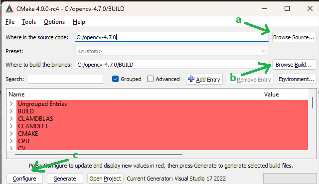
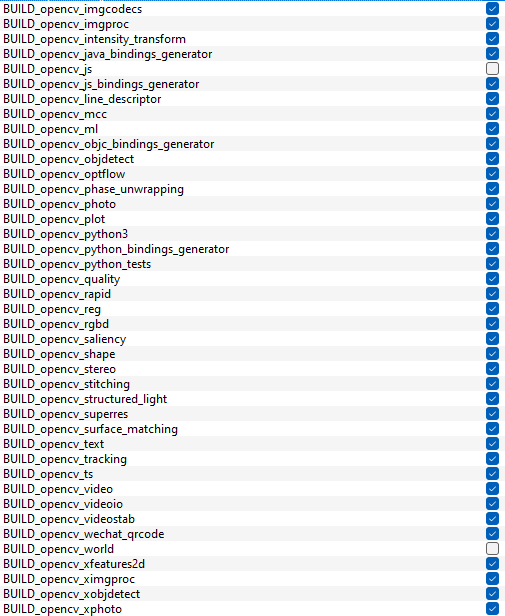
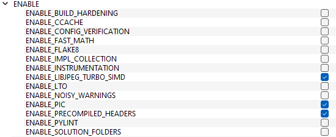
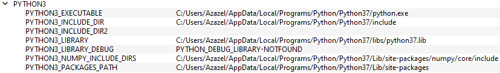

# 🛠️ BachelorGUI2025 – SubSea GUI System

A cross-platform graphical interface and backend system for processing and streaming media in real time using Python, OpenCV, .NET, and Node.js.

---

## 📖 Table of Contents

- [Prerequisites](#-prerequisites)
- [Installation](#-installation)
  - [🐧 Linux (Ubuntu/Debian) Setup](#linux-ubuntudebian-setup)
  - [🪟 Windows Setup](#windows-setup)
- [Usage](#-usage)
- [License](#-license)

---

## 📦 Prerequisites

- Python 3.7
- Node.js (v18 or later)
- .NET SDK (v8.0 or later)
- CMake with GUI
- GStreamer and FFmpeg

---

## 🧰 Setup Guides

<details>
<summary><strong>🔧 Linux (Ubuntu/Debian) Setup Guide</strong></summary>

### Linux (Ubuntu/Debian) Setup

1. Download the GUI project from the repository.

2. Open a terminal and run the following commands (Skip any step you've already completed):

   ```bash
   sudo apt update
   sudo apt install -y software-properties-common
   sudo add-apt-repository ppa:deadsnakes/ppa
   sudo apt update
   sudo apt-get install python3.7 python3.7-venv python3.7-distutils python3.7-dev python3.7-numpy
   sudo apt-get install libsrtp2-dev
   sudo apt-get install gcc g++
   ```

3. Install GTK, camera, and media support:

   ```bash
   sudo apt-get install libavcodec-dev libavformat-dev libswscale-dev
   sudo apt-get install libgstreamer-plugins-base1.0-dev libgstreamer1.0-dev
   sudo apt-get install libgtk-3-dev
   sudo apt-get install libpng-dev
   sudo apt-get install libjpeg-dev
   sudo apt-get install libopenexr-dev
   sudo apt-get install libtiff-dev
   sudo apt-get install libwebp-dev
   ```

4. Verify Python version:

   ```bash
   python3.7 --version
   ```

5. Navigate to the project backend:

   ```bash
   cd BachelorGUI2025/Backend
   ```

6. Create and activate a virtual environment:

   ```bash
   python3.7 -m venv myenv
   source myenv/bin/activate
   ```

7. Navigate to the Python scripts:

   ```bash
   cd PythonScripts
   ```

8. Install Python dependencies:

   ```bash
   pip install -r requirements.txt
   ```

9. Install GStreamer:

   ```bash
   sudo apt install gstreamer1.0-tools gstreamer1.0-plugins-base \
   gstreamer1.0-plugins-good gstreamer1.0-plugins-bad \
   gstreamer1.0-plugins-ugly gstreamer1.0-libav \
   libgstreamer1.0-dev
   ```

10. Install FFmpeg:

    ```bash
    sudo apt install ffmpeg
    ```

11. Manually compile OpenCV:

    - Install CMake and CMake GUI:

      ```bash
      sudo apt-get install cmake
      sudo apt-get install cmake-qt-gui
      ```

    - To open CMake later:

      ```bash
      cmake-gui
      ```

    - Download and set up OpenCV 4.7.0 and Contrib:

      ```bash
      mkdir ~/opencv_build && cd ~/opencv_build
      git clone -b 4.7.0 https://github.com/opencv/opencv.git
      git clone -b 4.7.0 https://github.com/opencv/opencv_contrib.git
      cd opencv
      mkdir build && cd build
      ```

    - Open CMake GUI **from a terminal where the virtual environment is active**.

    - In CMake GUI:
        - Set the source code path to the `opencv` folder.
        - Set the build path to the `opencv/build` folder.
        - Add `OPENCV_EXTRA_MODULES_PATH` pointing to `opencv_contrib/modules`.

    - Click **Configure** and verify the GStreamer and Python fields are set correctly.

    > 🖼️ *Insert image here: opencv_linux2.png* (Example of correct CMake configuration)

    - Choose the generator (e.g., `Unix Makefiles`).

    - Build OpenCV:

      ```bash
      make -j4
      ```

    - Install OpenCV:

      ```bash
      sudo make install
      ```

    - Copy the `cv2` folder to your virtual environment:

      ```bash
      cp -r cv2 ~/BachelorGUI2025/Backend/myenv/lib/site-packages
      ```

    - Verify installation:

      ```bash
      python -c "import cv2; print(cv2.__version__)"
      ```

12. Install Node.js, npm, and .NET 8:

    ```bash
    sudo apt install nodejs npm
    sudo apt install dotnet-sdk-8.0
    ```

13. Build and run the backend:

    ```bash
    cd Backend
    dotnet restore
    dotnet build
    dotnet run
    ```

14. Start the frontend:

    ```bash
    cd ../GUI-Frontend
    npm i
    npm start
    ```

</details>

<details>
<summary><strong>🔧 Windows Setup Guide</strong></summary>

### Windows Setup

1. **Download the GUI project from the UiS SubSea repo on Github:**
   - Link: [Your Repo Link Here](https://github.com/UiS-SubSea/your-repo-name)

2. **Download Python version 3.7.0**
   - Go to the [Python 3.7.0 Release Page](https://www.python.org/downloads/release/python-370/)
   - Download the installer for your Windows version (e.g. *Windows x86-64 executable installer*).
   - Install Python and **ensure** the "Add Python to PATH" option is **checked** during installation.

3. **Install NumPy in Python 3.7** (needed to compile OpenCV).

4. **Open the folder `BachelorGUI2025\Backend` in a terminal.**

5. **Create a virtual environment:**
   ```bash
   python3.7 -m venv myenv
   ```

6. **Activate the virtual environment:**
   ```bash
   .\myenv\Scripts\activate
   ```
   - To deactivate:
     ```bash
     deactivate
     ```

7. **Navigate to the PythonScripts folder:**
   ```bash
   cd PythonScripts
   ```

8. **Install dependencies:**
   ```bash
   pip install -r requirements.txt
   ```

9. **Manually compile OpenCV with GStreamer support:**

   - **Download and install CMake 4.0.0** from the [CMake Download Page](https://cmake.org/download/)
   - Choose: `cmake-4.0.0-windows-x86_64.msi`

   - **Download OpenCV 4.7.0 and OpenCV Contrib**, and create a `build` folder inside the OpenCV directory.

   - **Install GStreamer 1.24.12**:
     - [GStreamer 1.24.12 (MSVC) Download Page](https://gstreamer.freedesktop.org/data/pkg/windows/1.24.12/msvc/)
     - Download and install both:
       - `gstreamer-1.0-msvc-x86_64-1.24.12.msi`
       - `gstreamer-1.0-devel-msvc-x86_64-1.24.12.msi`
     - Add the GStreamer `bin` folder to your system PATH.

   - **Install FFmpeg** from [FFmpeg Builds](https://www.gyan.dev/ffmpeg/builds/)

   - **Install Visual Studio 2022 (version 17)** from [Visual Studio](https://visualstudio.microsoft.com/)

   - **Compile OpenCV using CMake GUI:**

     1. Open `CMake-gui`
     2. Set "Browse Source..." to the OpenCV folder.
     3. Set "Browse Build..." to the `build` folder.

     

     4. Click **Configure**, choose *Visual Studio 17*, then **Finish**.

     <div align="center">
       
     </div>

     5. Wait for analysis to complete. Red entries will appear.

     6. Expand the `WITH` section, enable necessary features.

     <div align="center">
       
       
     </div>

     7. Expand the `BUILD` section and adjust as needed.

     <div align="center">
       
       
     </div>

     8. Expand `ENABLE`, disable `ENABLE_SOLUTION_FOLDERS`.

     <div align="center">
       
     </div>

     9. Ensure GStreamer fields are present and set correctly.

     <div align="center">
       
     </div>

     10. Check the `PYTHON3` field paths.

     <div align="center">
       
     </div>

     11. Add `OPENCV_EXTRA_MODULES_PATH` pointing to the OpenCV Contrib modules folder.

     12. Click **Configure** again. Scroll the log window to check for `YES` next to GStreamer.

     <div align="center">
       
     </div>

     13. If all is good, click **Generate**, then **Open Project**.

     14. Set build mode to **Release**.

     15. In Solution Explorer, right-click **Solution** or **ALL_BUILD** → **Build**.

     16. Once done, right-click **INSTALL** and build it. This installs OpenCV-Python.

     <div align="center">
       
     </div>

     17. Copy the `cv2` folder from OpenCV into your virtual environment:
     ```
     BachelorGUI2025\Backend\myenv\Lib\site-packages
     ```

     18. **Verify installation:**
     ```bash
     python -c "import cv2; print(cv2.__version__)"
     ```

10. **Install Node.js (v18+), npm, and .NET (v8+):**
    > ⚠️ Replace `sudo apt` with Windows installers — this was meant for Linux.

    - Download [Node.js 18](https://nodejs.org/en/)
    - Install [.NET SDK 8.0](https://dotnet.microsoft.com/en-us/download/dotnet/8.0)

11. **Navigate to the Backend folder and run:**
    ```bash
    dotnet restore
    dotnet build
    ```

12. **Start the backend:**
    ```bash
    dotnet run
    ```

13. **Start the frontend:**

    - Navigate to the `GUI-Frontend` folder.

    - Install dependencies:
      ```bash
      npm i
      ```

    - Start frontend:
      ```bash
      npm start
      ```

</details>

